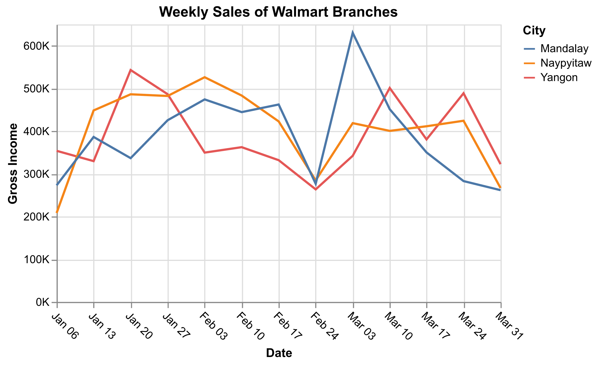
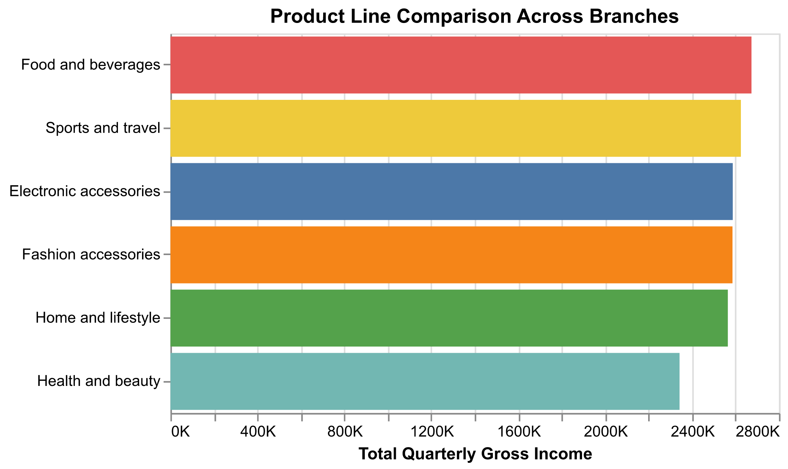

# Supermarket Sales Performance Dashboard Proposal

## 1. Motivation and Purpose

### Target Audience

The target audience for this dashboard is regional supermarket managers and business analysts. I am acting as a data analyst responsible for providing insights into customer behavior, product performance, and revenue drivers.

### Problem

Supermarket managers need to understand which product lines generate the most revenue, how customer demographics influence purchasing behavior, and how different payment methods and locations impact profitability. Without a clear analytical dashboard, it is difficult to identify high-performing segments or detect patterns in customer satisfaction and revenue generation.

### Solution

This dashboard will provide interactive visualizations that allow managers to explore sales performance by branch, city, product line, customer type, and payment method. It will help identify revenue drivers, analyze customer satisfaction ratings, and compare profitability across branches. This supports strategic decisions related to marketing, pricing, and product placement.

---

## 2. Description of the Data

The dataset contains 1000 transaction-level records from Walmart supermarket branches, with 17 variables.

### Stats

- Observations: 1000 transactions
- Variables: 17 columns
- Each row represents a single purchase transaction.

Key variables include:

- `Branch` – Store branch (A, B, C)
- `City` – Store location
- `Customer type` – Member or Normal
- `Gender` – Customer gender
- `Product line` – Product category
- `Unit price` – Price per item
- `Quantity` – Number of items purchased
- `Total` – Total transaction amount
- `Payment` – Payment method
- `gross income` – Gross profit from transaction
- `Rating` – Customer satisfaction rating

### Relevance

The `Total` and `gross income` variables measure revenue and profitability. Categorical variables such as `Product line`, `Branch`, `City`, and `Customer type` allow segmentation analysis. `Rating` provides insight into customer satisfaction. Together, these variables allow comprehensive performance and behavioral analysis.

---

## 3. Research Questions & Usage Scenarios

### User Persona and Usage Scenario

The user of this dashboard is an Operations Manager for Walmart, located in Myanmar. They are responsible for monitoring the Operations of branches in three cities (Yangon, Naypyitaw, Mandalay) and providing data-driven insight for actionable financial improvements. They are primarily concerned with tracking microeconomic variables like daily sales revenue, transaction volume and cost of goods over time for the branches, while monitoring how these responses are spread across different product lines, payment methods and customer characteristics. Using these metrics and an effective dashboard, the user can make timely, informed logistical decisions on large scale inventory, as well as propose new product and membership offerings. The dashboard will enable these insights through time-series plots with adjustable scales, accompanied with aggregate sales data plots/summaries across categorizations of products and customers.

### Usage Stories

1. As the Operations manager, I want to monitor sales metrics over time so I can spot peaks, dips, and trends for high-level store planning, labour allocation and performance improvement targets.

2. As the Operations manager, I want to see which product lines are gaining/losing importance so I can detect structural shifts and react with inventory/promo focus.

3. As the Operations manager, I want to identify the top product lines and whether their rankings differ by sales vs gross income so I know what to prioritize in the annual report.

---

## 4. Exploratory Data Analysis

The line plot below addresses usage story 1, however the bar plot below more directly addresses usage story 2 and 3, but can also be applied to usage story 1 as it relates to inventory and logistical planning for product lines. The line plot looks at the sales data on a weekly time scale, whereas the bar plot aggregates sales for the entire first quarter.

The gross income per branch was plotted on a weekly time scale to eliminate plotting noise that was seen on a daily sales scale. This is likely due to certain times of the week having higher or lower shopping traffic and thus higher or lower gross income. From the weekly sales plot the Operations Manger can see that the performance is fairly similar for each city. Given a longer time horizon (with updated data flowing to the dashboard), the user may be able to see a difference in performance between cities and therefore could investigate potential reasons for this difference. The timeframe of the gross sales will be adjustable on the dashboard, to enable the user to scope out relevant trends.

The quarterly aggregated gross income was plotter per product line to reveal differences in sales categories. In order to see any significant difference given the short timeframe of the dataset, the aggregation was performed over the entire dataset and all the Walmart branches. Given more data supplied to the dashboard and timeframe toggles for aggregation, further insights can be drawn from the user. The user can deduce from the plot that the Health and Beauty product lines are under-performing compared to the other product lines which are performing similarly. This difference may help the user identify an opportunity for beneficial changes to the Health and Beauty sections of the stores to increase sales.

---

## 5. App Sketch & Description

> This sketch is generated by [GPT-5.2](https://openai.com/index/introducing-gpt-5-2/), and is intended to be a preliminary design for the dashboard. The final design may differ based on user feedback and technical constraints.

The dashboard is organized into four sections: a global control panel on the left, a time-series plot for different metrics, a stacked filled area plot for product line performance, and a bar plot for top product lines. The time-series plot will show the selected sales metric (e.g., total sales, gross income) over time, with options for daily or weekly aggregation. The stacked filled area plot will display the performance of different product lines over time, allowing the user to see how each category contributes to overall sales. The bar plot will show the top 5 product lines based on the selected sales metric, providing a quick overview of which categories are performing best.
