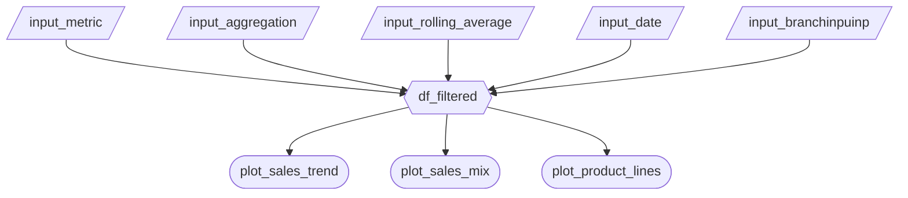

# App specification

## Updated Job Stories

## Component Inventory

## Reactivity Diagram

```mermaid
flowchart TD
  A[/input_metric/] --> F{{df_filtered}};
  B[/input_aggregation/] --> F;
  C[/input_rolling_average/] --> F;
  D[/input_date/] --> F;
  E[/input_branchinpuinp/] --> F;
  F --> P1([plot_sales_trend]);
  F --> P2([plot_sales_mix]);
  F --> P3([plot_product_lines]);  
```