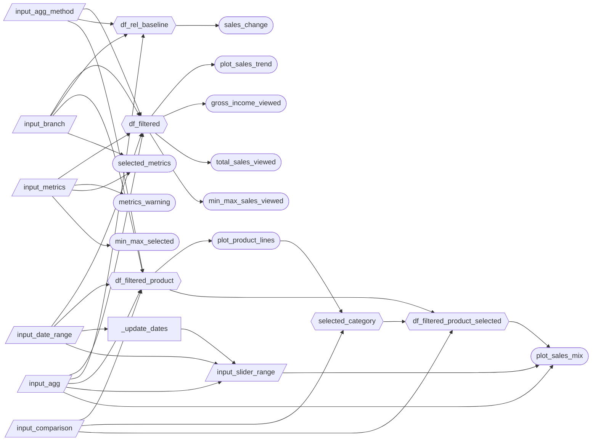
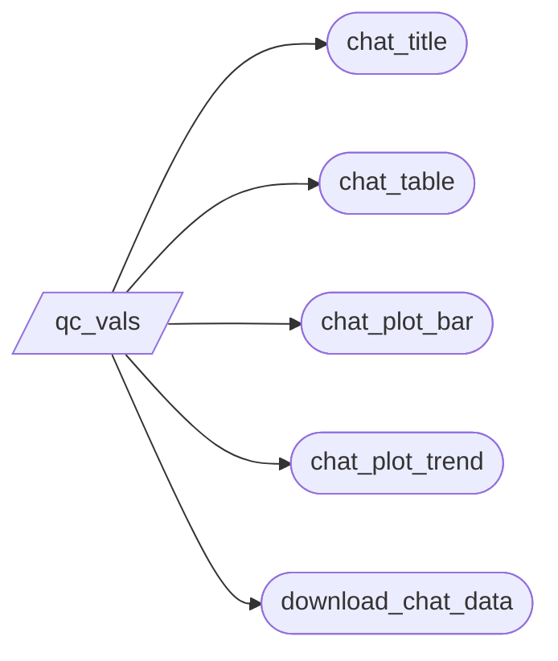

# App specification

## Updated User Stories

| #   | User Story                       | Status         | Notes                         |
| --- | ------------------------------- | -------------- | ----------------------------- |
| 1   | As the Operations manager, I want to monitor sales metrics over time for all three branches combined or specific branches, so I can spot peaks, dips, and trends for high-level store planning, labour allocation and performance improvement targets overall or for a specific branch. | 🔄 Revised | Modified to include examination of the performance of all branches together or a specific selected branch on the dashboard, for a more targeted look at sales metric trends over time.                             |
| 2   | As the Operations manager, I want to see which product lines are gaining/losing importance, as well as how sales are spread across payment methods and customer characteristics (like gender, membership, etc.), so I can detect structural shifts and react with inventory/promo focus.| 🔄 Revised     | Added sales metric mix over time across multiple toggleable categories to make the dashboard more informative to the user beyond just the product lines, and now supports click-based filtering from the ranked bar chart to focus the sales mix chart on a selected category.|
| 3   | As the Operations manager, I want to identify the top product lines, payment methods and customer characteristics over the entire analyzed time period, and whether the rankings differ by sales vs gross income so I know what to prioritize in the annual report.|  🔄 Revised   | Expanded the set of ranked categories for sales metrics to include other categories than just product line to compliment the sales  mix over time chart and user story 2 output, as well as provided high-level sales insight for the entire examined period of time.|

## Database

- Reactive calculations now rely on the walmart data in parquet format and a ibis/duckdb connection (as of release 0.4.0).
- DataFrame calculations described below are lazily evaluated based on the database reference rather than the `csv` data.

## Component Inventory

### Dashboard

| ID | Type | Shiny widget / renderer | Depends on | User story |
| --- | --- | --- | --- | --- |
| `input_metrics` | Input | `ui.input_checkbox_group()` | -- | #1, #3 |
| `input_agg` | Input | `ui.input_radio_buttons()` | -- | #1, #2 |
| `input_agg_method` | Input | `ui.input_radio_buttons()` | -- | #1, #2, #3 |
| `input_date_range` | Input | `ui.input_date_range()` | -- | #1, #2 |
| `input_branch` | Input | `ui.input_select()` | -- | #1, #2, #3 |
| `input_comparison` | Input | `ui.input_select()` | -- | #2, #3 |
| `input_slider_range` | Input | `ui.input_slider()` | `input_agg`,`input_date_range`, `_update_dates` | #2 |
| `_update_dates` | Reactive effect | `@reactive.effect` | `input_date_range` | #2 |
| `df_filtered` | Reactive calc | `@reactive.calc` | `input_metrics`, `input_agg`, `input_agg_method`, `input_date_range`, `input_branch` | #1 |
| `df_rel_baseline` | Reactive calc | `@reactive.calc` | `input_branch`, `input_agg`, `input_agg_method` | #1 |
| `df_filtered_product` | Reactive calc | `@reactive.calc` | `input_agg`, `input_agg_method`, `input_date_range`, `input_branch`, `input_comparison` | #2, #3 |
| `selected_category` | Reactive calc | `@reactive.calc` | `plot_product_lines`, `input_comparison` | #2 |
| `df_filtered_product_selected` | Reactive calc | `@reactive.calc` | `df_filtered_product`, `selected_category`, `input_comparison` | #2 |
| `plot_sales_trend` | Output | `@render_altair` | `df_filtered` | #1 |
| `plot_sales_mix` | Output | `@render_altair` | `df_filtered_product_selected`, `input_comparison`, `input_slider_range`, `input_agg` | #2 |
| `plot_product_lines` | Output | `@render_altair` | `df_filtered_product`, `input_comparison`, `input_agg_method` | #3 |
| `metrics_warning` | Output | `@render.ui` | `input_metrics` | #1 |
| `sales_change` | Output | `@render.ui` | `df_filtered`, `df_rel_baseline`, `input_metrics` | #1 |
| `gross_income_viewed` | Output | `@render.text` | `df_filtered` | #1 |
| `total_sales_viewed` | Output | `@render.text` | `df_filtered` | #1 |
| `selected_metrics` | Output | `@render.text` | `input_metrics`, `input_branch` | #1 |
| `min_max_sales_viewed` | Output | `@render.text` | `df_filtered`, `input_metrics` | #1 |
| `min_max_selected` | Output | `@render.text` | `input_metrics` | #1 |

### LLM Chat
| ID | Type | Shiny widget / renderer | Depends on | User story |
| --- | --- | --- | --- | --- |
| `qc_vals` | Reactive (server) | `qc.server()` | - | #1, #2, #3 |
| `chat_title` | Output | `@render.text` | `qc_vals` | #1, #2, #3 |
| `chat_table` | Output | `@render.data_frame` | `qc_vals` | #1, #2, #3 |
| `chat_plot_bar` | Output | `@render_altair` | `qc_vals` | #1, #2, #3 |
| `chat_plot_trend` | Output | `@render_altair` | `qc_vals` | #1, #2, #3 |
| `download_chat_data` | Output | `@render.download` | `qc_vals` | #1, #2, #3 |

## Reactivity Diagram

### Dashboard

### LLM Chat

## Calculation Details

The dashboard consists of multiple reactive calculations that take user input changes and automatically update the plotted outputs and KPI outputs on the dashboard in real time. Each reactive calculation depends on user inputs which can be modified in the left-hand dashboard panel or, in the case of the new interactive feature, by clicking a ranked bar in the bottom-right plot. These reactive calculations produce different modified DataFrames or selected state values, which are then consumed by `altair` charts and text/UI outputs. These inputs allow the user to change which sales metrics are displayed, the aggregation method used per period, the examined date range, whether the metrics are displayed for a single branch or for all the branches combined, and whether the sales mix chart is focused on one clicked comparison category.

### `df_filtered`

- Inputs: `input_metrics`, `input_agg`, `input_agg_method`, `input_date_range`, `input_branch`
- Transformation: filter the raw dataset by date range, selected metrics, chosen aggregation method, aggregation period and selected branches in a way compatible with the sales trend plot and KPI summaries.
- Outputs:
  - `plot_sales_trend`: An Altair chart that displays the time series lines in the top half of the dashboard.
  - `gross_income_viewed`: A KPI text output displaying gross income over the selected period.
  - `total_sales_viewed`: A KPI text output displaying total sales over the selected period.
  - `min_max_sales_viewed`: A KPI text output displaying the maximum and minimum of the selected metric over the selected period.

### `df_rel_baseline`

- Inputs: `input_branch`, `input_agg`, `input_agg_method`
- Transformation: aggregate the January 2019 baseline data for the selected branch and aggregation settings so the current selection can be compared to a fixed baseline month.
- Outputs:
  - `sales_change`: A KPI output displaying the percentage change in sales relative to the January 2019 baseline.

### `df_filtered_product`

- Inputs: `input_agg`, `input_agg_method`, `input_date_range`, `input_branch`, `input_comparison`
- Transformation: filter the raw dataset by date range, selected comparison dimension, chosen aggregation method, aggregation period and selected branches in a way compatible with the stacked area and ranked bar plots.
- Outputs:
  - `plot_product_lines`: An Altair chart of the ranked bars displayed in the bottom right of the dashboard.
  - `df_filtered_product_selected`: Supplies the base category-level data used for optional click-based filtering of the stacked area chart.

### `selected_category`

- Inputs: `plot_product_lines`, `input_comparison`
- Transformation: read the clicked bar selection from the ranked bar chart and extract the selected comparison category value so that the bar chart can behave like an input control.
- Outputs:
  - `df_filtered_product_selected`: A filtered lower-chart DataFrame based on the clicked category.

### `df_filtered_product_selected`

- Inputs: `df_filtered_product`, `selected_category`, `input_comparison`
- Transformation: if a ranked bar is clicked, filter the lower-chart dataset to the selected comparison category; otherwise, return the full lower-chart dataset.
- Outputs:
  - `plot_sales_mix`: An Altair chart of the stacked area over time displayed in the bottom left of the dashboard.

## Tests

To verify the core logic of the dashboard, the following tests have been implemented:

- `filter_data()` : Unit tests (`pytest`) to ensure that for every input (date range, aggregation method and range, comparison column, branch), the function filters the dataframe as expected. This ensures that the plots `plot_sales_mix` and `plot_product_lines` show the correct data. 

- Playwright UI tests (`pytest-playwright`) to verify that user interactions with the dashboard filters correctly update the UI:
  - `test_branch_filter_updates_display`: Verifies that selecting a specific branch updates the value boxes, ensuring the dashboard responds to branch filter changes.
  - `test_date_range_filter`: Verifies that changing the date range updates the dashboard, ensuring only data within the selected range is displayed.
  - `test_aggregation_toggle`: Verifies that switching between Day and Week aggregation correctly updates the radio button state, ensuring the time grouping logic works correctly for both modes.
