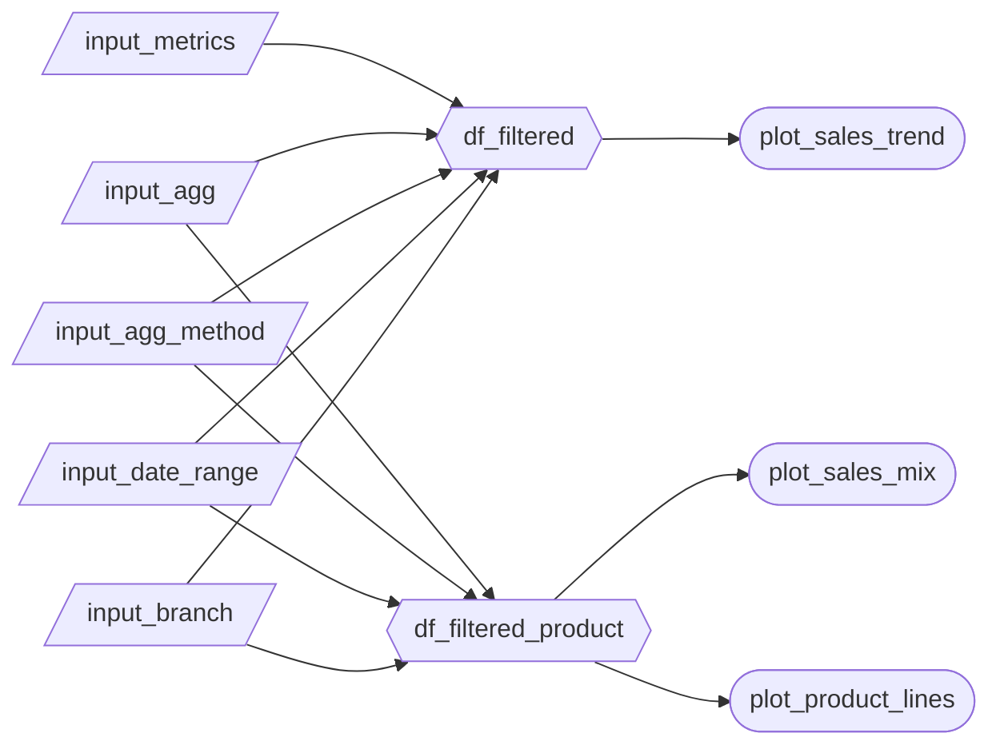

# App specification

## Updated Job/User Stories

| #   | Job/User Story                       | Status         | Notes                         |
| --- | ------------------------------- | -------------- | ----------------------------- |
| 1   | As the Operations manager, I want to monitor sales metrics over time for all three branches combined or specific branches, so I can spot peaks, dips, and trends for high-level store planning, labour allocation and performance improvement targets overall or for a specific branch. | 🔄 Revised | Modified to include examination of the performance of all branches together or a specific selected branch on the dashboard, for a more targeted look at sales metric trends over time.                             |
| 2   | As the Operations manager, I want to see which product lines are gaining/losing importance, as well as how sales are spread across payment methods and customer characteristics (like gender, membership, etc.), so I can detect structural shifts and react with inventory/promo focus.| 🔄 Revised     | Added sales metric mix over time across multiple toggleable categories to make the dashboard more informative to the user beyond just the product lines.|
| 3   | As the Operations manager, I want to identify the top product lines, payment methods and customer characteristics over the entire analyzed time period, and whether the rankings differ by sales vs gross income so I know what to prioritize in the annual report.|  🔄 Revised   | Expanded the set of ranked categories for sales metrics to include other categories than just product line to compliment the sales  mix over time chart and user story 2 output, as well as provided high-level sales insight for the entire examined period of time|

## Component Inventory

| ID | Type | Shiny widget / renderer | Depends on | User story |
| --- | --- | --- | --- | --- |
| `input_metrics` | Input | `ui.input_checkbox_group()` | -- | #1, #3 |
| `input_agg` | Input | `ui.input_radio_buttons()` | -- | #1 |
| `input_agg_method` | Input | `ui.input_radio_buttons()` | -- | #2 |
| `input_date_range` | Input | `ui.input_date_range()` | -- | #1, #2 |
| `input_branch` | Input | `ui.input_select()` | -- | #1, #2, #3 |
| `df_filtered` | Reactive calc | `@reactive.calc` | `input_metrics`, `input_agg`, `input_agg_method`, `input_date_range`, `input_branch` | #1 |
| `df_filtered_product` | Reactive calc | `@reactive.calc` | `input_metrics`, `input_agg`, `input_agg_method`, `input_date_range`, `input_branch` | #2, #3 |
| `plot_sales_trend` | Output | `@render.plot` | `df_filtered` | #1 |
| `plot_sales_mix` | Output | `@render.plot` | `df_filtered_product` | #2 |
| `plot_product_lines` | Output | `@render.plot` | `df_filtered_product` | #3 |

## Reactivity Diagram

## Calculation Details
For each @reactive.calc in your diagram, briefly describe:

Which inputs it depends on.
What transformation it performs (e.g., "filters rows to the selected year range and region(s)").
Which outputs consume it.

