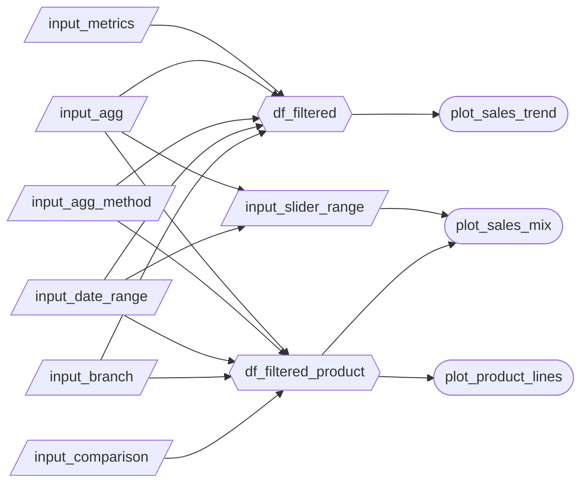

# App specification

## Updated Job Stories

## Component Inventory

| ID | Type | Shiny widget / renderer | Depends on | User story |
| --- | --- | --- | --- | --- |
| `input_metrics` | Input | `ui.input_checkbox_group()` | -- | #1, #3 |
| `input_agg` | Input | `ui.input_radio_buttons()` | -- | #1 |
| `input_agg_method` | Input | `ui.input_radio_buttons()` | -- | #2 |
| `input_date_range` | Input | `ui.input_date_range()` | -- | #1, #2 |
| `input_branch` | Input | `ui.input_select()` | -- | #1, #2, #3 |
| `input_comparison` | Input | `ui.input_select()` | -- | #2, #3 |
| `input_slider_range` | Input | `ui.input_slider()` | `input_agg`,`input_date_range` | #2 |
| `df_filtered` | Reactive calc | `@reactive.calc` | `input_metrics`, `input_agg`, `input_agg_method`, `input_date_range`, `input_branch` | #1 |
| `df_filtered_product` | Reactive calc | `@reactive.calc` | `input_metrics`, `input_agg`, `input_agg_method`, `input_date_range`, `input_branch`,`input_comparison` | #2, #3 |
| `plot_sales_trend` | Output | `@render.plot` | `df_filtered` | #1 |
| `plot_sales_mix` | Output | `@render.plot` | `df_filtered_product`, `input_comparison`, `input_slider_range` | #2 |
| `plot_product_lines` | Output | `@render.plot` | `df_filtered_product`, `input_comparison` | #3 |

## Reactivity Diagram

